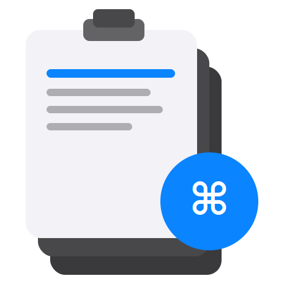
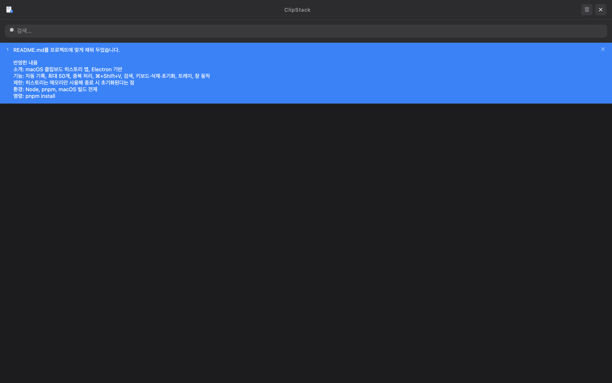

# ClipStack

<p align="center">
  
</p>

<p align="center">
  macOS용 클립보드 히스토리 관리 앱
</p>

---

## 소개

ClipStack은 [Electron](https://www.electronjs.org/) 기반의 **클립보드 히스토리 매니저**입니다. 복사한 텍스트를 자동으로 기록하고, 전역 단축키로 빠르게 불러와 다시 붙여넣을 수 있습니다.

## 주요 기능

| 기능              | 설명                                                                        |
| ----------------- | --------------------------------------------------------------------------- |
| **자동 기록**     | 클립보드 텍스트 변경을 0.5초 간격으로 감지, 최대 50개 보관 (중복 자동 제거) |
| **전역 단축키**   | `⌘ + Shift + V`로 어디서든 창을 열고 닫기                                   |
| **검색**          | 상단 검색창으로 히스토리 실시간 필터링                                      |
| **키보드 탐색**   | `↑` / `↓` 선택, `Enter` 복사 후 닫기, `Esc` 닫기                            |
| **항목 삭제**     | 개별 삭제 및 전체 비우기                                                    |
| **트레이 아이콘** | 메뉴바에서 열기/종료                                                        |
| **자동 숨김**     | 포커스를 잃으면 자동으로 창 숨김                                            |

> **참고**: 히스토리는 메모리에만 저장됩니다. 앱을 종료하면 목록은 사라집니다.

## 스크린샷



## 필요 환경

- [Node.js](https://nodejs.org/) (LTS 권장)
- [pnpm](https://pnpm.io/)
- macOS (빌드 타깃 기준)

## 설치 및 실행

```bash
# 의존성 설치
pnpm install

# 개발 모드 실행
pnpm start
```

## macOS 앱 빌드

```bash
pnpm build
```

산출물은 `dist/` 디렉토리에 DMG, ZIP 형태로 생성됩니다.

## 프로젝트 구조

```
clipstack/
├── main.js              # 메인 프로세스 (창, 트레이, 전역 단축키, 클립보드 폴링, IPC)
├── preload.js           # contextBridge로 렌더러에 안전한 API 노출
├── index.html           # UI 레이아웃
├── style.css            # 다크 테마 스타일
├── renderer.js          # 목록 렌더링, 검색, 키보드 탐색 처리
├── clipstack_icon.svg   # 앱 아이콘
├── assets/              # 트레이 아이콘 이미지
├── build/               # 빌드용 아이콘 (.icns)
└── package.json         # 프로젝트 설정 및 electron-builder 빌드 설정
```

## 단축키 요약

| 단축키          | 동작                                   |
| --------------- | -------------------------------------- |
| `⌘ + Shift + V` | ClipStack 창 토글 (열기/닫기)          |
| `↑` / `↓`       | 목록 항목 탐색                         |
| `Enter`         | 선택한 항목 클립보드에 복사 후 창 닫기 |
| `Esc`           | 창 닫기                                |

## 기술 스택

- **Electron** — 크로스 플랫폼 데스크톱 앱 프레임워크
- **electron-builder** — macOS DMG/ZIP 패키징

## 라이선스

MIT
